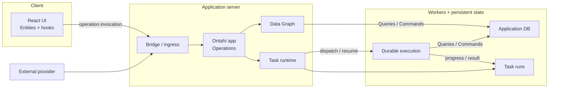

# One Application

An Ontahí application begins by saying what exists and what can carry it.

```ts
export const TodoApplication = ontahi({
  storage: defaultStorage,
  tasks: inProcessTasks(),
  entities: [TodoList, Tag, TodoTag, Todo],
});
```

This is the composition root. It is the point where the semantic model meets the implementations
that will execute it.

The entities say what the application knows. Storage says how graph reads and changes are carried
out. The task runtime says how durable operations progress. Capabilities, when present, supply
narrow powers that entity operations need but do not own.

The result is not only a registry of entities.

`TodoApplication` can resolve and invoke operations. It can expose reflected application metadata.
It can supply entity data to Ontahí Explorer. Its graph is the graph consumed by server code,
codegen, browser projections, and runtime adapters.

There is one application model because these surfaces must not disagree about what exists.

## The composition boundary

An Ontahí application has three sides:

```text
semantic declarations  ->  application  ->  runtime interpretation
```

Semantic declarations contain domain meaning: entity identity, relations, selections, operation
contracts, and dependencies.

Runtime implementations contain execution knowledge: how to read PostgreSQL, how to invoke an
operation over HTTP, how to continue durable work, or how to emit telemetry.

The application binds them. It does not move provider details into the entity, and it does not make
the runtime rediscover the domain from a second configuration.

## Runtime topology

One semantic application can be interpreted across several processes:



This is a logical topology, not a required deployment. `inProcessTasks()` collapses the task
runtime, worker, and task state into the server process. A persistent runtime may separate them
without changing the Entity or durable operation contract.

## A host chooses implementations

The smallest application can use process-local storage and tasks:

```ts
const application = ontahi({
  storage: createInMemoryDataGraphStorage(),
  tasks: inProcessTasks(),
  entities: [TodoList, Tag, TodoTag, Todo],
});
```

A persistent host can replace storage without replacing the entity declarations:

```ts
const application = ontahi({
  storage: createPostgresDataGraphStorage({ pool }),
  tasks,
  entities: [TodoList, Tag, TodoTag, Todo],
});
```

Ontahí defines the graph behavior that storage must implement. The PostgreSQL adapter interprets
that behavior as SQL and conventionally maps the registered Entities. The host still owns the
pool, migrations, physical schema, mapping exceptions, process lifecycle, and credentials.

That separation is the recurring form:

- the framework defines meaning;
- an adapter interprets a framework contract;
- the host chooses and configures the adapter.

## Mount the application

Transport begins after composition:

```ts
server.use(
  ontahiExpress(TodoApplication, {
    explorer: { indexFile },
  }),
);
```

Express does not own the operations. It exposes the operations already registered in the
application. The same is true of reflection, task snapshots, and Explorer data: the adapter gives
them an HTTP shape without creating a second model.

## What belongs here

The composition root owns choices that affect the whole application:

- the complete public entity catalog;
- graph storage;
- durable task execution;
- host capabilities;
- application-wide runtime policy.

Entity behavior stays with its entity. Physical mappings stay with storage composition. HTTP
middleware stays with the host.

The next chapter begins inside the entity declaration: the place where a thing receives fields,
identity, relations, dependencies, and operations.
