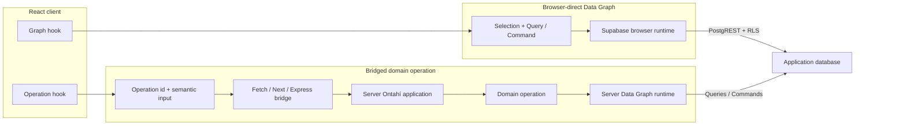

# Transport, Bridges, and HTTP Ingress

Node can invoke `TodoList.rename(...)` directly. Once that same intention crosses a process
boundary, a transport must carry it without becoming a second definition of the operation.

Ontahí currently has two different HTTP shapes:

- an **operation bridge** carries generic invocations from an Ontahí client;
- **HTTP ingress** gives a particular operation an external route and provider channel.

## Carry generic operation invocations

The Express adapter mounts the already composed application:

```ts
const server = express();

server.use(
  ontahiExpress(TodoApplication, {
    explorer: { indexFile },
  }),
);
```

One mount exposes the application surfaces that have an HTTP representation:

- `POST /operations` invokes operations and answers permission checks;
- `GET /operations/tasks/:taskId/:runId` observes durable runs;
- `GET /application` returns reflected application metadata;
- `/explorer/*` serves inspection endpoints when Explorer is enabled.

The bridge envelope contains an operation identity and opaque input:

```ts
{
  kind: 'invoke',
  operationId: 'TodoList.rename',
  input: {
    list: 'list-inbox',
    name: 'Reading queue',
  },
}
```

Application code does not normally construct this envelope. The generated browser Entity and its
React hooks do it through the bridge adapter. The server dispatcher resolves the operation,
normalizes Refs and Selections, validates input, checks authority, executes it, and returns the same
canonical result used by other runtimes.

Express or Next.js therefore supplies one invocation bridge, not one hand-authored endpoint per
operation.

## Two client execution paths

Not every client-side graph action needs the bridge. Ontahí can interpret ordinary Data Graph
Queries and Commands in a browser runtime backed by Supabase, while domain operations travel as
semantic intentions to the server:



Browser-direct does not bypass Ontahí. The client still authors Entities, Selections, Queries, and
Commands; the Supabase runtime compiles them and the database enforces its RLS policy. No domain
operation intention crosses a server boundary. Both paths may reach the same physical database;
what changes is the authority and the runtime that interprets the work.

The bridge carries something more abstract: “rename this TodoList” or “complete this Selection.”
The server operation may combine graph work, Capabilities, requirements, contracts, or durable
execution before producing its canonical result.

Use browser-direct execution only where the declared authority and database policy make that graph
behavior legitimate. Use a bridged operation when the intention, policy, coordination, secret, or
runtime belongs on the server.

## Give an operation explicit HTTP ingress

External systems create different pressure. A webhook already has its own route, authentication,
headers, event vocabulary, delivery identity, and payload shape.

A production BookOps operation, shortened to its ingress-bearing contract, declares where one
normalized provider channel enters it:

```ts
syncFromGithubPush: operation({
  exposure: 'server-only',
  input: SyncFromGithubPushInputSchema,
  ingress: [
    ingress.http({
      method: 'POST',
      route: '/api/ingress/github/webhook',
      provider: 'github-webhook',
      channel: 'source-control.push',
    }),
  ],
  run: syncFromGithubPush,
}),
```

`server-only` keeps the operation out of the first-party browser bridge. Its explicit ingress is a
separate decision: an authenticated GitHub push may still request that operation.

The route is reflected with the operation. Explorer and the host can discover it from the same
application model; no generated endpoint registry is required.

HTTP ingress is broader than webhooks. A provider may be a small JSON decoder for a custom
endpoint. Webhooks are the demanding case because they add external event vocabularies,
signatures, delivery identities, retries, and provider-specific acknowledgements.

## Authenticate and decode before dispatch

The Entity does not receive a raw `Request`. A host provider owns the external protocol:

- read the raw body and provider headers;
- verify the webhook signature;
- parse and validate the provider payload;
- classify the request as accepted, ignored, or rejected;
- emit a normalized `channel`, `deliveryId`, and operation input payload.

The runtime flow is:

```text
HTTP request
  -> provider verification and decoding
  -> { providerKey, channel, deliveryId, payload }
  -> reflected ingress route match
  -> canonical operation dispatcher
  -> operation
```

BookOps composes that boundary once:

```ts
const ingressRouter = createGraphHttpIngressRouter({
  routes: BookopsDataGraphApi.listHttpIngress(),
  providers: {
    'github-webhook': createGitHubWebhookIngressProvider({
      getSecret: requireGitHubWebhookSecret,
    }),
  },
  dispatch: createGraphHttpIngressOperationDispatcher({ dispatcher }),
});

export const POST = (request: Request) => ingressRouter.handle(request);
```

`dispatcher` is the same transport-neutral operation dispatcher used by the first-party bridge.
Only the path from the external request to its semantic input is provider-specific.

## One webhook route, different operations

A provider endpoint does not have to equal one operation. BookOps uses the same GitHub webhook
route for at least two channels:

- `source-control.push` enters the book-sync operation;
- `source-control.installation.deleted` enters the installation-removal operation.

The provider understands GitHub's event vocabulary and emits the channel. Reflected ingress
metadata selects the operation that owns that meaning. Neither operation contains signature code
or a switch over every GitHub event.

> [!MARGIN] **An event is not an operation invocation.** A webhook reports that something happened;
> an operation invocation requests application work. The provider and ingress mapping cross that
> boundary deliberately. This leaves room for one event to be ignored, invoke one operation, or
> eventually fan out without pretending the two concepts are identical.

## Keep delivery semantics explicit

A valid signature proves the source of a delivery. It does not establish domain authorization,
make repeated deliveries harmless, or make external acknowledgement atomic with application work.

Transport delivery deduplication and operation idempotency are related but different guarantees.
A durable operation can return a run reference quickly and continue elsewhere; the host still owns
webhook acknowledgement policy, retries, raw-body handling, secrets, correlation, and observability.

> [!MARGIN] **Current low-level surface.** `ingress.http(...)` and its reflected route are the stable
> direction. Provider registries, router mounting, delivery context, and resource binding remain
> low-level APIs in motion. They should not force Express, Next.js, or a provider name into the
> enduring domain meaning of an operation.

The same dispatcher boundary can be carried by Fetch, Express, Next.js, a webhook, or a future
queue or CLI adapter. Transport changes how an invocation travels; it does not redefine what the
operation means.
