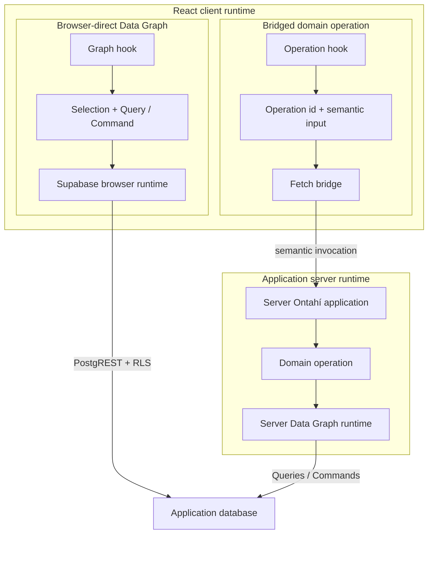

# Transport and HTTP Ingress

A \concept{Transport} carries an operation intention across a process boundary without becoming
a second definition of that operation. Node can invoke `TodoList.rename(...)` directly; a remote
client needs that intention to reach the same application runtime.

Ontahí currently has two different HTTP shapes:

- an **operation bridge** carries generic invocations from an Ontahí client;
- **HTTP ingress** gives a particular operation an external route and provider channel.

## Carry generic operation invocations

The Express adapter mounts the already composed application:

```ts
const ontahiHttp = {
  mountPath: '/runtime/ontahi',
};

const server = express();

server.use(
  ontahiExpress(TodoApplication, {
    ...ontahiHttp,
    explorer: { indexFile },
  }),
);
```

`mountPath` places every Ontahí-owned HTTP surface below one host-selected root:

- `POST /runtime/ontahi/operations` invokes operations and answers permission checks;
- `GET /runtime/ontahi/operations/tasks/:taskId/:runId` observes durable runs;
- `GET /runtime/ontahi/application` returns reflected application metadata;
- `/runtime/ontahi/explorer/*` serves inspection endpoints when Explorer is enabled.

The client receives the same host configuration:

```ts
const bridge = createFetchOperationBridgeAdapter(ontahiHttp);
```

The bridge derives both the invocation and task-observation endpoints. There is no global discovery
step: the mount root is deployment configuration supplied to each runtime. This also allows one
Express application to host several Ontahí applications under different roots.

> [!MARGIN] **Express configuration stops at the adapter boundary.** Mount and surface paths,
> Explorer exposure, ingress body limits, and error reporting belong here. CORS, authentication,
> rate limiting, request identity, and trust-proxy policy remain ordinary host middleware unless a
> future Ontahí contract gives them semantic meaning.

The bridge envelope contains an operation identity and opaque input:

```ts
{
  kind: 'invoke',
  operationId: 'TodoList.rename',
  input: {
    list: {
      kind: 'selection',
      entityName: 'TodoList',
      expression: {
        kind: 'references',
        refs: [{
          kind: 'entity-ref',
          entityName: 'TodoList',
          locator: { id: 'list-inbox' },
        }],
      },
    },
    name: 'Reading queue',
  },
}
```

Application code does not normally construct this envelope. It passes an ID, Ref, record, or
Selection to the generated Entity; input normalization produces the semantic Selection above
before the bridge sends it. The server dispatcher resolves the operation, validates that input,
checks authority, executes it, and returns the same canonical result used by other runtimes.

Express or Next.js therefore supplies one invocation bridge, not one hand-authored endpoint per
operation.

## Two client execution paths

Not every client-side graph action needs the bridge. Ontahí can interpret ordinary Data Graph
Queries and Commands in a browser runtime backed by Supabase, while domain operations travel as
semantic intentions to the server:



Browser-direct does not bypass Ontahí. The client still authors Entities, Selections, Queries, and
Commands; the Supabase runtime compiles them and the database enforces its RLS policy. No domain
operation intention crosses a server boundary. Both paths may reach the same physical database;
what changes is the authority and the runtime that interprets the work.

The bridge carries something more abstract: “rename this TodoList” or “complete this Selection.”
The server operation may combine graph work, Capabilities, requirements, contracts, or durable
execution before producing its canonical result.

Use browser-direct execution only where the declared authority and database policy make that graph
behavior legitimate. Use a bridged operation when the intention, policy, coordination, secret, or
runtime belongs on the server.

The current generic bridge is operation-first. A larger direction is to let an ordinary Query or
Command cross the same runtime boundary when storage is server-only, while keeping authorization as
an independent graph policy rather than forcing an otherwise empty wrapper operation. See
[Data Graph Across Boundaries](../05-further-directions/11-data-graph-across-boundaries.md).

## Give an operation explicit HTTP ingress

External systems create different pressure. A webhook already has its own route, authentication,
headers, event vocabulary, delivery identity, and payload shape.

Suppose an application needs to synchronize content after a GitHub push. The operation can remain
available through the generic bridge and also declare a provider-specific entrance:

```ts
syncFromGithubPush: operation({
  exposure: 'bridge',
  input: SyncFromGithubPushInputSchema,
  ingress: [
    ingress.http({
      method: 'POST',
      route: '/webhooks/github',
      provider: 'github-webhook',
      channel: 'source-control.push',
    }),
  ],
  run: syncFromGithubPush,
}),
```

`Content.syncFromGithubPush(...)` and the generic operation bridge still work. The explicit ingress
adds another way to request the same operation under the custom route. If the operation should only
be reachable through the external integration, it can instead use `exposure: 'server-only'`.

With the earlier mount root, the public webhook URL is
`/runtime/ontahi/webhooks/github`. The declared route stays relative to the Ontahí application; the
host decides where the complete runtime lives.

The route is reflected with the operation. Explorer and the host can discover it from the same
application model; no generated endpoint registry is required.

HTTP ingress is broader than webhooks. A provider may be a small JSON decoder for a custom
endpoint. Webhooks are the demanding case because they add external event vocabularies,
signatures, delivery identities, retries, and provider-specific acknowledgements.

## Authenticate and decode before dispatch

The Entity does not receive a raw `Request`. A host provider owns the external protocol:

- read the raw body and provider headers;
- verify the webhook signature;
- parse and validate the provider payload;
- classify the request as accepted, ignored, or rejected;
- emit a normalized `channel`, `deliveryId`, and operation input payload.

The runtime flow is:

```text
HTTP request
  -> provider verification and decoding
  -> { providerKey, channel, deliveryId, payload }
  -> reflected ingress route match
  -> canonical operation dispatcher
  -> operation
```

The application composes that boundary once:

```ts
server.use(
  ontahiExpress(Application, {
    mountPath: '/runtime/ontahi',
    ingress: {
      providers: {
        'github-webhook': createGitHubWebhookIngressProvider({
          getSecret: requireGitHubWebhookSecret,
        }),
      },
    },
  }),
);
```

`ontahiExpress(...)` reads the reflected routes and supplies the same transport-neutral dispatcher
used by the first-party bridge. The provider registry is the only application-specific transport
wiring: it verifies and normalizes each external protocol.

The provider contract itself does not depend on Express. A Next.js, Koa, or future HTTP adapter can
reuse the registry and the canonical ingress router while owning its framework-specific raw request
and response conversion.

## One webhook route, different operations

A provider endpoint does not have to equal one operation. An application integrated with GitHub can
use the same webhook route for several typed channels:

- `source-control.push` enters a content-sync operation;
- `source-control.installation.deleted` enters an integration-removal operation.

The provider understands GitHub's event vocabulary and emits the channel. Reflected ingress
metadata selects the operation that owns that meaning. Neither operation contains signature code
or a switch over every GitHub event.

> [!MARGIN] **An event is not an operation invocation.** A webhook reports that something happened;
> an operation invocation requests application work. The provider and ingress mapping cross that
> boundary deliberately. This leaves room for one event to be ignored, invoke one operation, or
> eventually fan out without pretending the two concepts are identical.

> [!MARGIN] **Channels point toward a wider event model.** Today an ingress channel lets an
> operation subscribe to one normalized external event. The same vocabulary could eventually join
> events produced by Entities and graph changes with events received from third-party systems. That
> would let workflows compose both worlds without making an event and an operation invocation the
> same thing. This unification is a direction, not yet a settled event API.

## Keep delivery semantics explicit

A valid signature proves the source of a delivery. It does not establish domain authorization,
make repeated deliveries harmless, or make external acknowledgement atomic with application work.

Transport delivery deduplication and operation idempotency are related but different guarantees.
A durable operation can return a run reference quickly and continue elsewhere; the host still owns
webhook acknowledgement policy, retries, raw-body handling, secrets, correlation, and observability.

> [!MARGIN] **Current low-level surface.** `ingress.http(...)` and its reflected route are the stable
> direction. HTTP adapters can now mount reflected routes from a provider registry, while delivery
> context, event fan-out, and resource binding remain APIs in motion. They should not force Express,
> Next.js, or another host technology into the enduring domain meaning of an operation.

The same dispatcher boundary can be carried by Fetch, Express, Next.js, a webhook, or a future
queue or CLI adapter. Transport changes how an invocation travels; it does not redefine what the
operation means.
