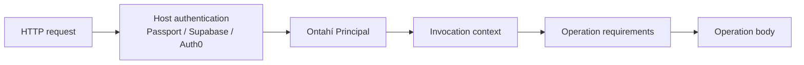

# Authentication and Principals

\concept{Authentication} resolves who is making an invocation. Passport, Supabase Auth, Auth0,
Okta, or another provider may establish that identity; Ontahí receives one provider-neutral
\concept{Principal} and carries it through the application runtime.

```ts
type Principal = {
  subject: string;
  kind: 'user' | 'service';
  issuer?: string;
};
```

`subject` is the stable identity assigned by the issuer. `kind` distinguishes a person from a
service caller. `issuer` preserves the identity namespace when it matters. Provider tokens,
sessions, email addresses, roles, and complete user profiles do not belong in this value.



> [!MARGIN] **The client does not assert its own Principal.** A Principal is not operation input and
> does not arrive inside the generic bridge envelope. The trusted host resolves it from a session,
> token, certificate, or another native mechanism before dispatching the invocation.

## Require authentication on an operation

`app.require.authenticated()` is the standard operation requirement for a caller that must be
present:

```ts
complete: operation({
  input: O.object({
    todos: self.many(),
  }),
  requires: [app.require.authenticated()],
  run: ({ todos }) => todos.update({ completed: true }),
}),
```

Without a Principal, the runtime returns the canonical `not_authenticated` failure before the
operation body runs. With a Principal, execution continues through the same contracts, concerns,
body, and effects as any other invocation.

Authentication says that a caller identity was established. It does not say that this caller may
complete these Todos. Authorization remains a separate operation policy expressed through
requirements while its richer semantic API evolves.

## Read the Principal when the body needs it

Presence may be the whole rule. When application behavior also needs the caller identity,
`app.auth.requirePrincipal()` returns it as an Effect and preserves the same canonical failure:

```ts
run: ({ draft }) =>
  Effect.gen(function* () {
    const principal = yield* app.auth.requirePrincipal();

    return yield* commands.insertReturning({
      ...draft,
      createdBy: principal.subject,
    });
  }),
```

`app.auth.currentPrincipal()` is the lower-level synchronous read when an adapter or synchronous
helper needs to inspect the current scope. Prefer `requirePrincipal()` inside an Effectful operation
when absence should become an expected operation failure.

## Supply the Principal from Express

Authentication middleware remains ordinary host code. Passport establishes `request.user`; the
Ontahí Express adapter maps that provider value once at the invocation boundary:

```ts
const principalFromPassport = (request: Request): Principal | null => {
  const user = request.user as TodoAuthenticatedUser | undefined;

  return user
    ? {
        subject: user.subject,
        kind: 'user',
        issuer: 'https://github.com',
      }
    : null;
};

server.use(session(sessionOptions));
server.use(passport.initialize());
server.use(passport.session());

server.use(
  ontahiExpress(TodoApplication, {
    invocationContext: request => ({
      principal: principalFromPassport(request),
    }),
  }),
);
```

Ontahí does not configure Passport, choose a strategy, own cookies, or store sessions. The host does
not pass `request.user` into every operation either. The runtime context carries the resulting
Principal across asynchronous requirements and operation execution.

The same boundary exists in `@ontahi/runtime-nextjs`: its invocation handler accepts an
`invocationContext` resolver, so a Next.js host can map a Supabase, Auth0, or custom session to the
same Principal without changing the Entity.

> [!MARGIN] **Keep rich provider data beside the Principal.** A host may also seed invocation
> `resources` with its complete user record when existing application code needs it. That resource
> stays provider-specific; the narrow Principal remains the portable identity used by Ontahí.

## Establish a scope outside HTTP

Node code, tests, jobs, and future transports use the same application operation without inventing
an HTTP request:

```ts
const principal = {
  subject: 'github-user-123',
  kind: 'user',
  issuer: 'https://github.com',
} as const;

await TodoApplication.app.runtime.withInvocationContext({ principal }, () =>
  TodoItem.complete({ todos: ['todo-123'] }),
);
```

`withInvocationContext(...)` is asynchronous-scope composition. Nested operation calls, permission
checks, and generic server Effects inherit the same Principal and invocation resources without
adding authentication parameters to domain contracts.

## Run the Todo example with GitHub

The complete
[`todo-express` example](https://github.com/javifernandes/ontahi/tree/main/examples/todo-express)
has two explicit compositions. Public mode leaves completion public:

```sh
pnpm todo:dev:local
```

GitHub mode installs the authentication requirement, mounts a real Passport OAuth flow, and fails
at startup when required configuration is missing:

```sh
TODO_GITHUB_CLIENT_ID=... \
TODO_GITHUB_CLIENT_SECRET=... \
TODO_SESSION_SECRET=... \
pnpm todo:dev:local -- --auth github
```

Configure the OAuth callback as `http://localhost:3001/auth/github/callback`. After login,
Passport's provider user becomes the Principal carried by `@ontahi/runtime-express`; logout removes
that session, and the same `TodoItem.complete` invocation is rejected before its body.

The Entity knows only whether completion requires an authenticated Principal. The Express host
knows how GitHub proves one. That boundary lets another host replace Passport and GitHub without
rewriting the operation.
