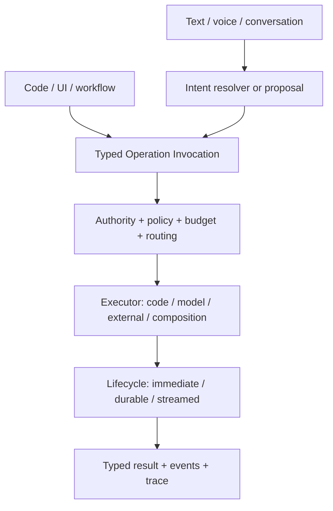

# Further Directions

Ontahí already makes domain meaning portable across Node, React, storage, transport, durable work,
code generation, and reflection. That is the important base. The next directions are not a list of
features to add to a framework; they ask what else can interpret the same semantic application.

The surfaces below are directions, not promises made by the current packages. Some have working
pieces. Others still need a durable contract before they deserve an API.

## Two concrete next moves

### Model-backed operations

An operation has an identity, typed input and output, authority, contracts, Capabilities, and
effects. None of that requires its implementation to remain an ordinary function forever.

A model-backed runtime could execute the same operation contract through an LLM. The caller would
still invoke an Ontahí operation and receive its canonical result. Runtime composition—not the
caller—would choose code, a model, an external system, or a composition.

This makes model execution part of the application language, not an AI layer attached above it.
The operation remains the semantic message. Its transport and current executor are replaceable.

There are two complementary places for a model in that flow. Text, voice, or conversation may be
fuzzy ingress that resolves into a typed invocation or a reviewable batch of proposed invocations.
A model may also execute an invocation that has already been selected. Intent resolution is not
execution, and neither one grants authority by itself.

An operation could begin as a soft semantic contract, gain stable model instructions and allowed
sources, and later harden through evaluations or deterministic code without changing its public
identity. Durability is a separate axis: code and model executors may each run immediately or as
durable work; an operation does not become durable merely because it became more mature.

Long-running agents add another dimension. They may need private working state: a filesystem,
object storage, memory, a vector index, or a resumable workspace. That state should be an explicit
runtime resource with its own lifecycle, not accidental Entity state and not invisible global
process state. Authoritative domain facts still belong to Entities; an agent workspace belongs to
the runtime carrying the work.

This direction needs more than a provider adapter. Ontahí must make allowed graph sources, tool
access, context assembly, budgets, progress, audit, evaluation, idempotency, replay, and human
approval visible enough to operate safely. Durable operations and reflected Capabilities provide
much of the vocabulary, but the model-backed execution contract is not yet defined.

> [!MARGIN] **“Actor” is overloaded.** A stateful LLM agent may behave like an actor, but it should
> not be confused with the actor in an authorization decision. The durable concept is an operation
> executor with declared powers and explicitly scoped working state.

### Selection as an editable language

The Selection AST already carries the same membership criterion through Node, React, operations,
and transports. Code is only one projection of that language.

A Selection language service can project the AST as a filter builder, assisted expression,
structural editor, or hybrid surface. Entity reflection can drive typed fields, operators,
completion, diagnostics, and Ref pickers. The result remains the canonical Selection AST, ready to
preview, save, share, or pass directly to an operation.

That makes a UI filter more than local component state. A user could visually author “Todos older
than 30 days,” inspect the resulting Selection, and invoke the same `Todo.complete(...)` operation
used by Node code. Text, chips, form controls, and raw AST become synchronized projections rather
than competing query languages.

## Continuous execution and first-class events

Polling task snapshots is the current portable baseline for durable work. The same `TaskRunRef`
and snapshot contract could later be observed through WebSocket, SSE, gRPC streaming, or another
push-capable adapter. Operations that naturally produce many values need a similarly explicit
stream contract: identity, ordering, backpressure, completion, failure, and reconnection should not
be guessed from a transport.

Events are the other half. An operation invocation requests work and expects a result. An event
states that something happened and may fan out, persist, replay, or feed projections. Ontahí's
current effect events and typed HTTP ingress channels are evidence for one reflected event model
covering both application facts and third-party facts.

With that model, notifications, cache invalidation, projections, workflows, and realtime UI can
subscribe to declared events without making domain code choose a queue or socket technology.

## Operational policy becomes semantic

Ontahí already has vendor-neutral telemetry ports, an OpenTelemetry adapter, operation concerns,
rate-limit machinery, and host-proven feature-flag requirements. They are not yet one settled,
graph-native policy surface.

The direction is to make operational decisions inspectable where they affect behavior:

- authorization and relationship policy;
- feature availability, rollout, and experiment variants;
- rate limits, concurrency, idempotency, retry, and overlap policy;
- telemetry, reporting, audit, cost, and latency budgets;
- clocks, scheduling, and cancellation.

These concerns still need host adapters and infrastructure. Reifying them does not move Redis,
Statsig, OpenTelemetry, or an authorization engine into the Entity. It preserves the semantic link
between an operation and the policy that governs its execution.

## From one graph to a topology of graphs

The current application composes one graph runtime. A later application may contain graph
segments: one cluster of Entities and operations on one server and storage system, another cluster
on a different runtime, and Refs or operations that cross the boundary.

That is more than configuring two database clients. Segmentation must make location, authority,
routing, consistency, partial failure, transactions, and deployment topology explicit. A Selection
may be executable inside one segment but require a planned distributed interpretation across
several. Reflection should be able to show where meaning lives and which runtime carries each edge.

This is the scale at which Ontahí can describe a modular monolith, several services, or a federated
system without asking each boundary to invent a second domain model.

## More adapters, same contracts

New adapters are valuable when they prove that the contracts are real:

- MySQL or MariaDB graph storage;
- document-oriented storage where its supported graph semantics are stated honestly;
- RabbitMQ, DBOS, Restate, or other durable task runtimes with real worker execution;
- gRPC, streaming, queue, or message-bus transports;
- Vue and other UI projections built from the same reflection and codegen boundaries.

An adapter should not be a logo on a compatibility list. It must implement a defined port, declare
its guarantees and limits, and pass the same behavioral contract as the existing runtimes. A
document store, relational database, browser runtime, and queue do not offer identical semantics;
Ontahí should preserve those differences rather than hiding them behind the lowest common
denominator.

## Living Entities

The farthest direction is allowing Entities, relations, and operations to be defined or evolved
dynamically. Reflection would stop being only a description of compiled declarations and become
part of a live model-authoring loop.

That requires schema versioning, migration, compatibility, policy, deployment, rollback, and
auditable model changes before it requires a clever builder UI. An LLM might propose a new Entity
or operation, but proposal, validation, approval, and activation must remain distinct acts.

Living Entities are therefore not the next feature. They are the horizon made conceivable by the
same premise used throughout this book: model the meaning explicitly, then let controlled runtimes
carry it.

## What the base makes possible

The ambition is not to become a small framework with many plugins. Ontahí treats domain meaning as
portable, reflected program data. That lets storage engines, transports, workers, UI projections,
tools, policies, and eventually model-backed executors participate in one application without each
reconstructing what the application means.

The current framework is useful before all of these directions exist. Its value is also that they
can be pursued as extensions of one semantic base instead of as disconnected infrastructure
features.
