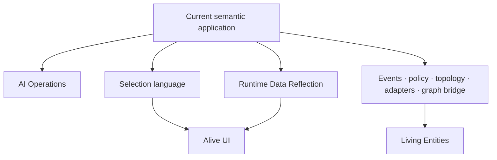

# Further Directions

Ontahí already makes domain meaning portable across Node, React, storage, transport, durable work,
code generation, and reflection. That is the important base. The next directions are not a list of
features to add to a framework; they ask what else can interpret the same semantic application.

The surfaces below are directions, not promises made by the current packages. Some have working
pieces. Others still need a durable contract before they deserve an API.

## Concrete semantic directions

Two lines are concrete enough to shape now:

- [**AI Operations**](02-ai-operations.md) keeps one typed operation while the
  runtime may execute it through code, a model, an external system, or a composition.
- [**Selection as an Editable Language**](03-selection-as-an-editable-language.md) treats filters,
  expressions, structural editors, and code as projections of the same Selection AST.

## From reflection to interaction

Two more directions form a dependency rather than a feature list:

- [**Runtime Data Reflection**](04-runtime-data-reflection.md) describes what a runtime can
  truthfully know and do with the live population behind an Entity or Selection.
- [**Alive UI**](05-alive-ui.md) consumes semantic reflection plus that runtime profile to choose
  viable headless interaction patterns and, optionally, visual components.

## Wider system directions

The same base opens several system-level lines:

- [**Continuous Execution and First-Class Events**](06-continuous-execution-and-first-class-events.md)
  separates observation streams, operation invocations, and facts that happened.
- [**Semantic Operational Policy**](07-semantic-operational-policy.md) makes authorization,
  rollout, limits, retries, telemetry, and budgets inspectable parts of execution.
- [**A Topology of Graphs**](08-a-topology-of-graphs.md) carries Entities, Refs, Selections, and
  operations across explicit runtime and storage segments.
- [**More Adapters, Same Contracts**](09-more-adapters-same-contracts.md) uses new storage,
  transport, task, and UI technologies to test the portability of the contracts.
- [**Living Entities**](10-living-entities.md) is the farther horizon: safely evolving the model
  itself at runtime.
- [**Data Graph Across Boundaries**](11-data-graph-across-boundaries.md) lets the same Query or
  Command bind to direct storage or a policy-controlled remote graph executor without an empty
  operation wrapper.

## What the base makes possible

The ambition is not to become a small framework with many plugins. Ontahí treats domain meaning as
portable, reflected program data. That lets storage engines, transports, workers, UI projections,
tools, policies, and eventually model-backed executors participate in one application without each
reconstructing what the application means.

The current framework is useful before all of these directions exist. Its value is also that they
can be pursued as extensions of one semantic base instead of as disconnected infrastructure
features.
