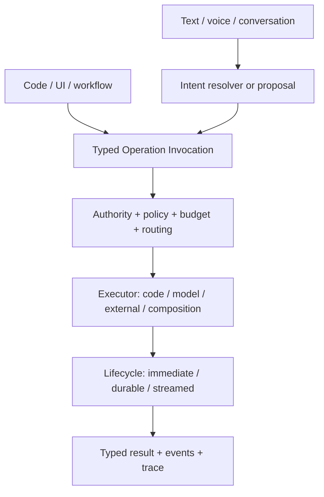
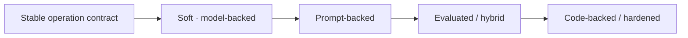

# AI Operations

An operation has an identity, typed input and output, authority, contracts, Capabilities, and
effects. None of that requires its implementation to remain an ordinary function forever.

`AI Operations` is the visible direction. Its precise runtime mechanism is model-backed operation
execution: the caller still invokes one Ontahí operation and receives its canonical result, while
runtime composition chooses code, a model, an external system, or a composition.

This makes AI part of the application language, not a layer attached above it. The operation
remains the semantic message. Its transport and current executor are replaceable.

## Two places for a model

Text, voice, or conversation may be fuzzy ingress that resolves into a typed invocation or a
reviewable batch of proposed invocations. A model may also execute an invocation that has already
been selected. Intent resolution is not execution, and neither one grants authority by itself.

## A path from fuzzy to petrified

An application can start from its Entities, operations, and use cases without waiting for every
implementation to be fully coded. A soft operation can use a model first, gain stable instructions
and evaluations, become hybrid, and eventually be petrified into cheaper and more deterministic
code where the domain has matured.

The public operation need not change along that path. Nor is code always the destination: fuzzy
judgement may remain the honest implementation for some capabilities. Durability is a separate
axis; code and model executors may each run immediately or as durable work.

## Working state without hidden state

Long-running agents may need private working state: a filesystem, object storage, memory, a vector
index, or a resumable workspace. That state should be an explicit runtime resource with its own
lifecycle, not accidental Entity state and not invisible global process state. Authoritative
domain facts still belong to Entities; an agent workspace belongs to the runtime carrying the
work.

This direction needs more than a provider adapter. Ontahí must make allowed graph sources, tool
access, context assembly, budgets, progress, audit, evaluation, idempotency, replay, and human
approval visible enough to operate safely. Durable operations and reflected Capabilities provide
much of the vocabulary, but the model-backed execution contract is not yet defined.

> [!MARGIN] **“Actor” is overloaded.** A stateful LLM agent may behave like an actor, but it should
> not be confused with the actor in an authorization decision. The durable concept is an operation
> executor with declared powers and explicitly scoped working state.
