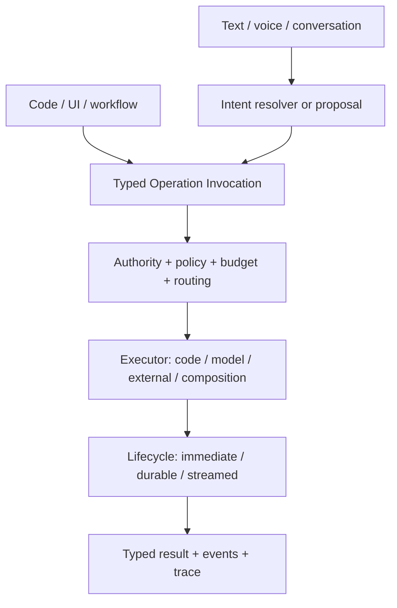

# Model-Backed Operations

An operation has an identity, typed input and output, authority, contracts, Capabilities, and
effects. None of that requires its implementation to remain an ordinary function forever.

A model-backed runtime could execute the same operation contract through an LLM. The caller would
still invoke an Ontahí operation and receive its canonical result. Runtime composition—not the
caller—would choose code, a model, an external system, or a composition.

This makes model execution part of the application language, not an AI layer attached above it.
The operation remains the semantic message. Its transport and current executor are replaceable.

## Two places for a model

Text, voice, or conversation may be fuzzy ingress that resolves into a typed invocation or a
reviewable batch of proposed invocations. A model may also execute an invocation that has already
been selected. Intent resolution is not execution, and neither one grants authority by itself.

An operation could begin as a soft semantic contract, gain stable model instructions and allowed
sources, and later harden through evaluations or deterministic code without changing its public
identity. Durability is a separate axis: code and model executors may each run immediately or as
durable work; an operation does not become durable merely because it became more mature.

## Working state without hidden state

Long-running agents may need private working state: a filesystem, object storage, memory, a vector
index, or a resumable workspace. That state should be an explicit runtime resource with its own
lifecycle, not accidental Entity state and not invisible global process state. Authoritative
domain facts still belong to Entities; an agent workspace belongs to the runtime carrying the
work.

This direction needs more than a provider adapter. Ontahí must make allowed graph sources, tool
access, context assembly, budgets, progress, audit, evaluation, idempotency, replay, and human
approval visible enough to operate safely. Durable operations and reflected Capabilities provide
much of the vocabulary, but the model-backed execution contract is not yet defined.

> [!MARGIN] **“Actor” is overloaded.** A stateful LLM agent may behave like an actor, but it should
> not be confused with the actor in an authorization decision. The durable concept is an operation
> executor with declared powers and explicitly scoped working state.
