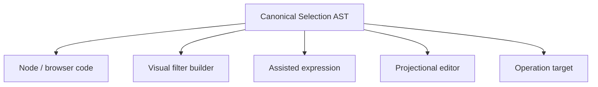

# Selection as an Editable Language

The Selection AST already carries the same membership criterion through Node, React, operations,
and transports. Code is only one projection of that language.

A Selection language service can project the AST as a filter builder, assisted expression,
structural editor, or hybrid surface. Entity reflection can drive typed fields, operators,
completion, diagnostics, and Ref pickers. The result remains the canonical Selection AST, ready to
preview, save, share, or pass directly to an operation.

That makes a UI filter more than local component state. A user could visually author “Todos older
than 30 days,” inspect the resulting Selection, and invoke the same `TodoItem.complete(...)` operation
used by Node code. Text, chips, form controls, and raw AST become synchronized projections rather
than competing query languages.
