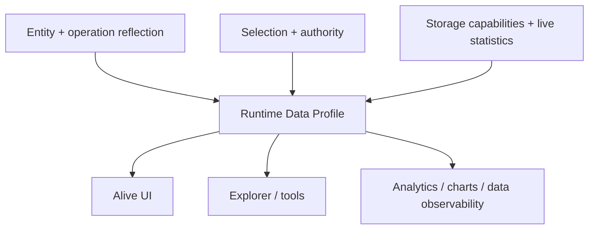

# Runtime Data Reflection

Entity reflection currently tells a tool what the application declares: fields, identity,
relations, operations, schemas, and authority. It does not yet describe the live population behind
that model or what the selected runtime can afford to do with it.

Runtime Data Reflection would expose dynamic, authority-aware facts about an Entity or Selection:

- population as an exact count, estimate, or unknown value;
- whether complete enumeration, search, filtering, sorting, sampling, and pagination are supported;
- result limits, approximation quality, freshness, expected latency, and execution cost;
- optional field profiles such as ranges, null ratios, distinct estimates, or common values.

The storage adapter is a primary source of this evidence, but it should not define the public
meaning. A search index, cache, projection, or remote graph segment may contribute different
capabilities. The runtime normalizes those observations into one semantic profile.

Ontahí already has a narrow first proof: reflected Entity data readers expose searchable,
filterable, sortable, paginated rows and an exact `totalCount`. The wider direction is to make
capability, cost, freshness, and approximation explicit instead of letting each UI infer them from
one successful request.

## Facts, not UI hints

“There are about two million eligible users and prefix search is indexed” is runtime knowledge.
“Render a typeahead” is presentation policy. Keeping them separate lets Alive UI, Explorer,
analytics, charts, and future tools make different decisions from the same truthful profile.

Profiles must obey the same authority as the data they summarize. A hidden row can still leak
through a count, a common-value histogram, or a latency difference. Unknown and approximate values
are therefore first-class results, not errors to conceal.
