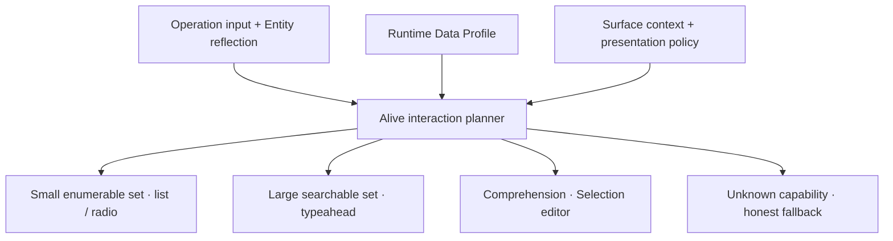

# Alive UI

Alive UI is a future headless component framework over Ontahí Entities, Selections, and operations.
It does not begin by assigning one widget to each schema type. It interprets semantic contracts
together with Runtime Data Reflection and the policy of the current surface.

Suppose `Book.transfer(...)` requires one `User`. If there are twelve eligible users and complete
enumeration is cheap, a radio list or compact picker may be honest. If there are two million users,
the same input needs indexed search, pagination, and a typeahead. If search is unavailable, the UI
must expose that limitation instead of attempting to download the population.

## Headless first, visual when useful

The durable output is an interaction plan plus state and behavior: how to enumerate, search,
select, validate, preview, and invoke. React, Vue, a terminal, or another host can project that
headless contract. An optional Ontahí visual kit may provide polished defaults without becoming the
semantic source of truth.

This preserves application control. A product may override the proposed pattern, supply its own
visual language, or impose stronger accessibility and latency policy. Alive UI removes repeated
plumbing; it does not erase product design.

The same engine could drive Ref inputs, operation forms, tables, bulk actions, filters, dashboards,
and previews. It becomes alive because the interaction responds to both the declared domain and
the live runtime—not because a component guesses from a TypeScript type.
