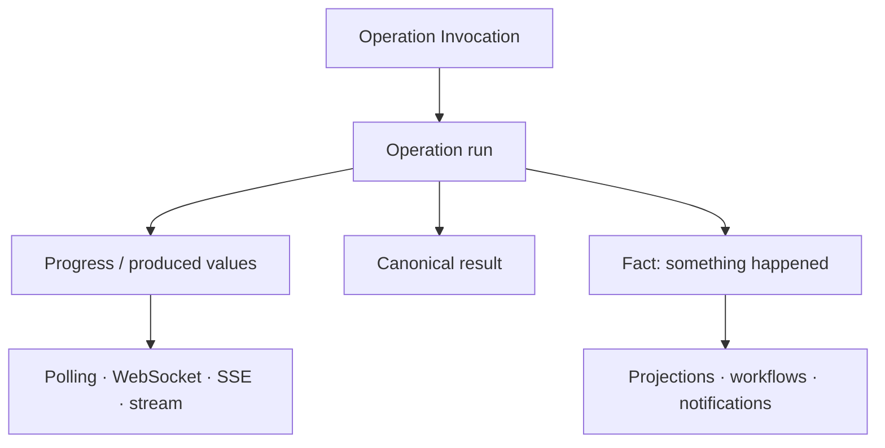

# Continuous Execution and First-Class Events

Polling task snapshots is the current portable baseline for durable work. The same `TaskRunRef`
and snapshot contract could later be observed through WebSocket, SSE, gRPC streaming, or another
push-capable adapter. Operations that naturally produce many values need a similarly explicit
stream contract: identity, ordering, backpressure, completion, failure, and reconnection should not
be guessed from a transport.

Events are the other half. An operation invocation requests work and expects a result. An event
states that something happened and may fan out, persist, replay, or feed projections. Ontahí's
current effect events and typed HTTP ingress channels are evidence for one reflected event model
covering both application facts and third-party facts.

With that model, notifications, cache invalidation, projections, workflows, and realtime UI can
subscribe to declared events without making domain code choose a queue or socket technology.
