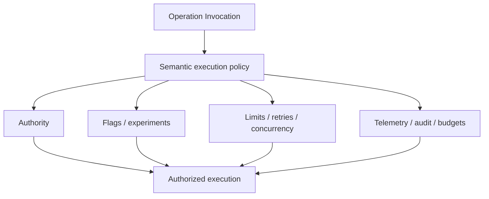

# Semantic Operational Policy

Ontahí already has vendor-neutral telemetry ports, an OpenTelemetry adapter, operation concerns,
rate-limit machinery, and host-proven feature-flag requirements. They are not yet one settled,
graph-native policy surface.

The direction is to make operational decisions inspectable where they affect behavior:

- authorization and relationship policy;
- feature availability, rollout, and experiment variants;
- rate limits, concurrency, idempotency, retry, and overlap policy;
- telemetry, reporting, audit, cost, and latency budgets;
- clocks, scheduling, and cancellation.

These concerns still need host adapters and infrastructure. Reifying them does not move Redis,
Statsig, OpenTelemetry, or an authorization engine into the Entity. It preserves the semantic link
between an operation and the policy that governs its execution.
