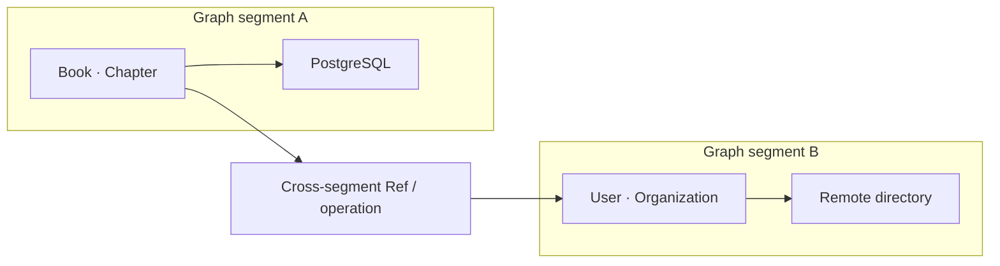

# A Topology of Graphs

The current application composes one graph runtime. A later application may contain graph
segments: one cluster of Entities and operations on one server and storage system, another cluster
on a different runtime, and Refs or operations that cross the boundary.

That is more than configuring two database clients. Segmentation must make location, authority,
routing, consistency, partial failure, transactions, and deployment topology explicit. A Selection
may be executable inside one segment but require a planned distributed interpretation across
several. Reflection should be able to show where meaning lives and which runtime carries each edge.

This is the scale at which Ontahí can describe a modular monolith, several services, or a federated
system without asking each boundary to invent a second domain model.
