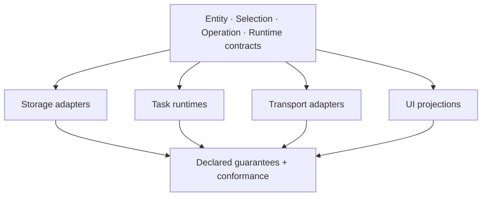

# More Adapters, Same Contracts

New adapters are valuable when they prove that the contracts are real:

- MySQL or MariaDB graph storage;
- document-oriented storage where its supported graph semantics are stated honestly;
- RabbitMQ, DBOS, Restate, or other durable task runtimes with real worker execution;
- gRPC, streaming, queue, or message-bus transports;
- Vue and other UI projections built from the same reflection and codegen boundaries.

An adapter should not be a logo on a compatibility list. It must implement a defined port, declare
its guarantees and limits, and pass the same behavioral contract as the existing runtimes. A
document store, relational database, browser runtime, and queue do not offer identical semantics;
Ontahí should preserve those differences rather than hiding them behind the lowest common
denominator.
