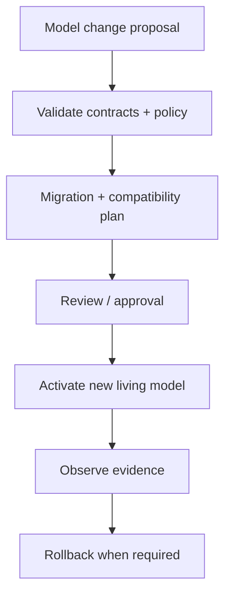

# Living Entities

The farthest direction is allowing Entities, relations, and operations to be defined or evolved
dynamically. Reflection would stop being only a description of compiled declarations and become
part of a live model-authoring loop.

That requires schema versioning, migration, compatibility, policy, deployment, rollback, and
auditable model changes before it requires a clever builder UI. An LLM might propose a new Entity
or operation, but proposal, validation, approval, and activation must remain distinct acts.

Living Entities are therefore not the next feature. They are the horizon made conceivable by the
same premise used throughout this book: model the meaning explicitly, then let controlled runtimes
carry it.
