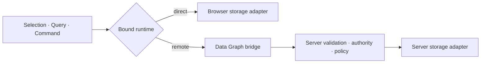

# Data Graph Across Boundaries

Today a browser with a Supabase runtime can interpret permitted Queries and Commands directly. A
browser backed by server-only PostgreSQL usually invokes a domain operation through a bridge, even
when the operation does nothing except execute one Query or Command.

That distribution detail should not force new domain vocabulary.

```ts
const staleTodos = TodoItem.selection(todo =>
  todo.updatedAt.lt(thirtyDaysAgo),
);

const rows = staleTodos
  .orderBy(todo => todo.title)
  .run();

const archival = staleTodos
  .update({ archived: true })
  .run();
```

The same code could bind to a direct browser adapter or to a remote Data Graph executor. The
Selection, Query, and Command already contain the semantic program; an operation wrapper adds no
meaning merely by transporting it.



This does not mean exposing arbitrary data access. A remote graph boundary can default to deny and
declare which Entities, fields, operators, relations, row scopes, cardinalities, and Commands an
authority may use. The server validates the portable AST and intersects requested targets with the
caller's permitted Selection. It never receives JavaScript, provider queries, table names, or SQL.

Supabase demonstrates the other topology: browser execution is legitimate only because the data
boundary enforces grants and row-level security. Ontahí can reflect and anticipate those rules, but
client-side checks are not authority.

A \concept{Operation} still matters when the application names behavior: enforce an invariant,
coordinate multiple changes, use secrets or capabilities, emit effects, or run durable work. The
distinction becomes semantic instead of infrastructural:

- Query and Command transport a Data Graph program.
- Operation invocation transports a named domain intention.

A remote graph runtime would make storage topology replaceable without changing the application's
language. It also creates a natural base for cache identity, Command reconciliation, observation,
and future graph segmentation.
