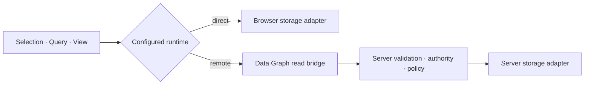

# Data Graph Across Boundaries

A browser with a Supabase runtime can interpret permitted Queries and Commands directly. A browser
backed by server-only PostgreSQL can now transport an ordinary Query to an authoritative Ontahí
runtime without declaring a wrapper Domain Operation.

That distribution detail does not force new domain vocabulary:

```tsx
const staleTodos = TodoItem.selection(todo =>
  todo.updatedAt.lt(thirtyDaysAgo),
);

const StaleTodo = TodoItem.view('StaleTodo', {
  id: true,
  title: true,
  updatedAt: true,
});

const rows = useGraphQuery(
  TodoItem
    .all()
    .where(staleTodos)
    .as(StaleTodo)
    .orderBy(todo => todo.title),
);
```

The same semantic Query can bind to a direct browser adapter or cross the remote Data Graph read
protocol. The Selection describes population, the View describes materialization, and execution
topology stays in runtime configuration.



## Remote access is explicit policy

Entity registration does not expose an Entity. The server installs one default-deny read policy
for each remotely accessible root:

```ts
const TodoReadPolicy = {
  entity: TodoItem,
  modes: ['get', 'run', 'count'],
  cardinalities: ['one', 'many'],
  maxLimit: 200,
  fields: {
    id: { select: true, filter: ['eq', 'in'] },
    ownerId: { filter: ['eq'] },
    title: { select: true, order: true },
    updatedAt: { select: true, filter: ['lt', 'gte'] },
  },
  scope: ({ authority, entity }) =>
    selection(entity, todo => todo.ownerId.eq(authority.ownerId)),
} satisfies GraphReadPolicy<typeof TodoItem, TodoAuthority>;
```

The boundary rebuilds the versioned JSON-safe graph program against canonical server Entities. It
checks fields, operators, ordering, Relation traversal, read mode, cardinality, and limits, then
intersects the requested Selection with the authority-owned scope. It never receives executable
JavaScript, provider queries, table names, SQL, or caller-authored authority.

`scope: 'all'` exists for deliberately public rows. Omitting a policy, field, Relation node, or
operator always denies that surface.

The policy authoring API is still an alpha surface and will gain more ergonomic composition. Its
default-deny meaning and authoritative server enforcement are not temporary.

## Identity crosses the client and server differently

The React provider receives an `ExecutionIdentity` so canonical Query keys cannot mix anonymous,
authenticated, tenant, service, or workspace state:

```tsx
<OntahiGraphProvider
  runtime={{ name: 'browser' }}
  identity={{
    principal: session.principal ?? null,
    cacheScope: session.workspaceId,
  }}
>
  <App />
</OntahiGraphProvider>
```

That identity partitions distributed cache state. It is not authorization. The host authenticates
the native request independently, derives the authoritative Principal, and supplies the policy
authority from trusted invocation context.

## Operations remain domain behavior

A \concept{Operation} still matters when the application names behavior: enforce an invariant,
coordinate multiple changes, use secrets or Capabilities, emit effects, require authorization, or
run durable work. The distinction is semantic instead of infrastructural:

- Query transport carries an ordinary Data Graph read;
- Operation invocation transports a named domain intention.

An Operation may itself define a semantic population by returning `self.one()` or `self.many()`.
The caller can apply a View, and the runtime composes that declarative Selection with the caller's
shape into one final Query.

## What remains directional

The remote protocol currently carries Queries, not Commands or streams. A browser write against
server-only storage still uses an Operation even when the eventual canonical form may be a direct
Command. Remote insert, update, upsert, and delete need an explicit write-policy algebra for
payload fields, affected-row bounds, authority scope, invariants, and cache reconciliation before
they become a safe transport surface.

Generated client Entities author portable Queries but are not yet directly runtime-bound for
fluent `.run()` outside the React executor. Telemetry, reflected policy diagnostics, hybrid graph
routing, and segmentation remain later capabilities over the same canonical program.

Supabase demonstrates the direct topology: browser execution is legitimate only because the data
boundary enforces grants and row-level security. Ontahí can reflect and anticipate those rules, but
client-side checks never become authority.
